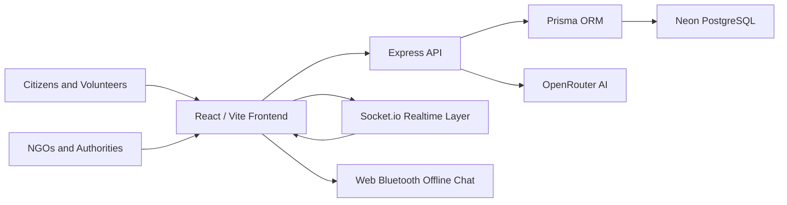

# Architecture

SignalFlare separates the mobile-first client, HTTP API, realtime socket layer, AI service, and database access. The current local server includes in-memory demo data so the product runs immediately. Production persistence is represented by the Prisma schema and Neon-ready database configuration.

## Frontend

- React 19, TypeScript, Vite
- TailwindCSS design system
- Framer Motion and Three.js visual effects
- React Query for server state
- Zustand for local operational state
- Leaflet map integration
- Web Bluetooth offline chat with local store-and-forward queue

## Backend

- Express with Helmet, CORS, rate limiting, and validation
- Socket.io for incidents, chat, notifications, resources, and assignments
- JWT and refresh-token helpers
- OpenRouter service wrapper
- Prisma schema for production persistence
