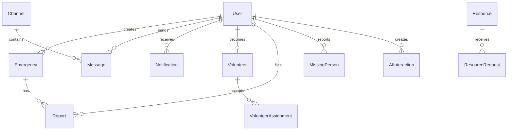

# ER Diagram

```mermaid
erDiagram
  User ||--o{ Emergency : creates
  User ||--o{ Message : sends
  User ||--o{ Notification : receives
  User ||--o| Volunteer : becomes
  User ||--o{ Report : files
  User ||--o{ MissingPerson : reports
  User ||--o{ AIInteraction : creates
  Emergency ||--o{ Report : has
  Resource ||--o{ ResourceRequest : receives
  Volunteer ||--o{ VolunteerAssignment : accepts
  Channel ||--o{ Message : contains
```
